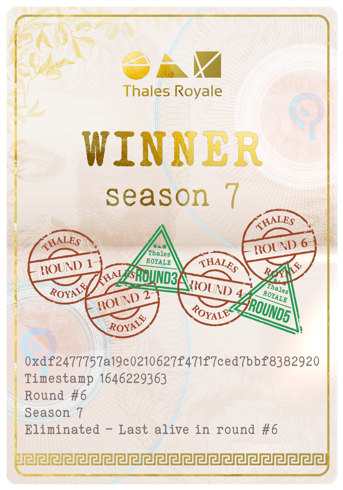

| id | Title | Status | Author | Description | Discussions to | Created |
| ----------- | ----------- | ----------- | ----------- | ----------- | ----------- | ----------- |
| TIP-42 |  Deployment of Thales Royale Passport evolving NFTs | Draft | padzank(@padzank) | Deploy Thales Royale Passport evolving NFTs to act as transferable Royale Season Positions | [Discord URL](https://discord.gg/hHH7EJf8M5) | 2022-04-09
 
## Simple Summary
 
This TIP proposes to deploy evolvable Thales Royale Passport NFTs on Optimism that will represent a transferable player season position.
 
## Abstract
 
By initial design, a user sign ups for Thales Royale with a 30 sUSD buy-in that whitelists that specific wallet for the ongoing Thales Royale Season participation. Recently we also introduced Thales Royale Pass NFT that is purchasable with 30 sUSD, and that NFT enables a wallet that is holding it a free Sign-Up for any 30 sUSD buy-in Thales Royale Season of choice. This TIP takes usage of utility NFTs in Thales Royale a big step further.  
**This TIP proposes to deploy Thales Royale Passport evolving NFTs that will represent a transferable player position for the season.** Thales Royale Passport NFT is minted on player Sign-Up and is graphically represented by a Passport-like document that shows player status for the current season, address that minted it, Passport number and place of residence (which is, of course, the metaverse).
 
## Motivation
 

 
 With the introduction of **Thales Royale Passport** evolving NFTs, the Thales ecosystem becomes one of the pioneers of using evolving NFTs as Utility for product offerings. After this deployment, the mechanism of participation is not in whitelisted buy-in wallets anymore but in the Passport NFTs themselves. The NFT itself represents the entity that is going through the Royale rounds. This means that this makes it  possible to transfer the Thales Royale Passport NFT to a different wallet, and then that wallet can pick off from  the previous wallet's position in the Royale season in question.  
 Thales Royale Passport is minted when a wallet Sign-Ups for Thales Royale Season by buying in with sUSD or with the Royale Pass. After the Sign-Up and the mint, the Royale Passport is a "blank page" with visible current season, address that minted it, Passport number and place of residence. The wallet holding the passport can use that passport to position for the current round of Thales Royale.  If the chosen position wins, the passport NFT evolves with the addition of a stamp showcasing a position which clears the round. If the chosen position loses, the passport NFT evolves into an eliminated passport. As the passport progresses rounds, more stamps are added until the final round is cleared and the passport evolves into its final form: The Season Winner Passport.  
 
The introduction of Thales Royale Passport NFT also unlocks the possibility of "taking profits" from your Thales Royale Season progress.  One can always put his Royale Passport on sale on the secondary market in the middle of the season for the purchaser to continue the battle.  It is also possible for one wallet to mint several Passports and switch between them and play multiple positions from one single wallet.  
 
## Specification
 
This TIP entails the Protocol DAO to deploy the [Thales Royale Passport evolving NFT contract](https://github.com/thales-markets/contracts/blob/main/contracts/ThalesRoyale/ThalesRoyalePassport.sol).
 
## Rationale
 
n/a
 
## Test Cases
 
n/a
 
## Implementation
 
n/a
 
## Copyright
 
Copyright and related rights waived via CC0.

